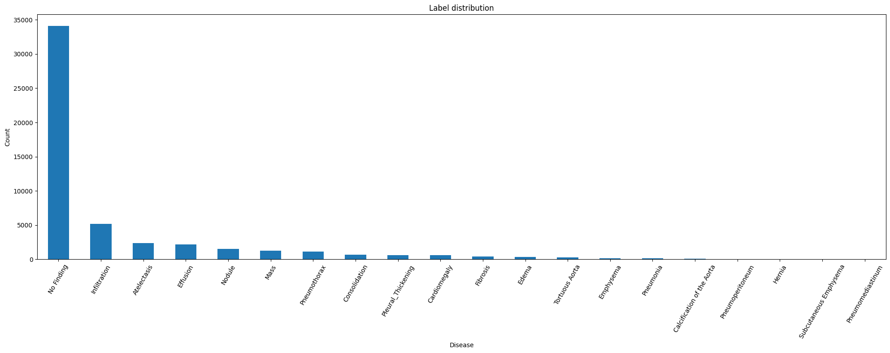
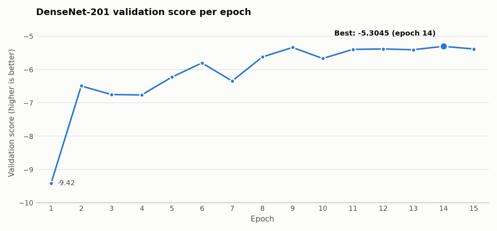

# Thoracic Disease Classification from Chest X-Rays

**Transfer learning, class-imbalance handling and cost-sensitive decision thresholds for 20-class chest X-ray diagnosis**

## Abstract

We study multi-class classification of chest X-ray images into **20 thoracic pathology classes**, including *No Finding*, under a clinically motivated evaluation metric that penalises a missed disease **five times more** than a false alarm and weights every class equally. The dataset is highly imbalanced: about two-thirds of the 51,043 training images are *No Finding*, while several pathologies have only a handful of examples.

We ran six controlled experiments across two model families. Starting from an EfficientNet-B0 baseline (score −6.03), we show that:

1. ImageNet normalisation is essential for transfer learning. Without it, the score collapses to about −13.
2. Increasing capacity within the EfficientNet family (B0 → B3) gives no meaningful gain.
3. A densely connected architecture (**DenseNet-201**) trained with **Focal Loss** and **class-balanced sampling** improves the score to −5.22.
4. **Per-class decision thresholds**, tuned directly on the evaluation metric, lift the final model to **−5.04** on the held-out test set (public split) without changing the network.

| | |
|---|---|
| **Task** | Single-label, 20-class chest X-ray classification |
| **Data** | 51,043 labelled training images · 17,015 held-out test images |
| **Final model** | DenseNet-201 (ImageNet-pretrained, `timm`), fine-tuned end-to-end |
| **Imbalance handling** | Class-balanced `WeightedRandomSampler` + Focal Loss (γ = 2) |
| **Optimisation** | AdamW, discriminative learning rates (head 1e-3 / body 1e-5), cosine annealing |
| **Post-processing** | Per-class decision thresholds tuned on the evaluation metric |
| **Best result** | **−5.04455** held-out test (public split) · −5.33888 (private split) |
| **Baseline** | EfficientNet-B0: −6.0348 |

---

## 1. Introduction

### Problem

Given a single chest X-ray, predict which one of 20 conditions is present: Atelectasis, Cardiomegaly, Consolidation, Edema, Effusion, Emphysema, Fibrosis, Hernia, Infiltration, Mass, Nodule, Pleural Thickening, Pneumonia, Pneumothorax, Pneumoperitoneum, Pneumomediastinum, Subcutaneous Emphysema, Tortuous Aorta, Calcification of the Aorta, or **No Finding**.

### Motivation

Chest radiography is one of the most widely used diagnostic tools in medicine, but interpreting it takes expertise. Findings can be subtle, image volumes are large, and radiologists vary in their readings. An accurate automated system can help triage urgent cases, reduce diagnostic errors and support resource-limited settings. This matters most for conditions such as **Pneumothorax** and **Pneumonia**, which need rapid intervention.

### Objective

In diagnosis, errors do not cost the same. A missed disease (false negative) can delay treatment. A false alarm (false positive) usually leads only to a follow-up test. The objective is therefore not accuracy but a **cost-sensitive, macro-averaged score** (Section 3). Under this metric, **per-class recall is critical**, and rare classes matter as much as common ones.

---

## 2. Dataset

| Split | Images | Labels |
|---|---:|---|
| Train | 51,043 | One-hot, 20 classes (exactly one positive per image) |
| Test | 17,015 | Hidden; scored on a held-out evaluation set |

The data is a curated subset of the NIH ChestX-ray collection [5]. It consists of a CSV of image IDs with 20 one-hot label columns and a folder of PNG images.



**Class imbalance is the central difficulty.** *No Finding* makes up roughly two-thirds of the training set, followed by *Infiltration*. Classes such as *Hernia*, *Pneumoperitoneum*, *Pneumomediastinum* and *Subcutaneous Emphysema* have only a handful of examples. A model that predicts *No Finding* for everything looks accurate but scores very badly under macro-averaging.

---

## 3. Evaluation metric

Each prediction outcome is scored per class:

| Outcome | Meaning | Score |
|---|---|---:|
| True Positive | Correctly predicting a disease | +1 |
| False Positive | Predicting a disease that is absent | −1 |
| False Negative | Missing a disease that is present | **−5** |

Confusing disease A with disease B counts as a false negative for A **and** a false positive for B. For each class $c$:

```math
\text{Score}_c = \frac{TP_c - FP_c - 5 \cdot FN_c}{N_c}
```

and the final score is the macro-average over all $C$ classes:

```math
\text{Final Score} = \frac{1}{C}\sum_{c=1}^{C} \text{Score}_c
```

Higher is better, and a perfect model scores **+1**. The metric is re-implemented as `custom_score()`, so **model selection and threshold tuning optimise exactly what the test evaluation measures**, rather than a proxy such as accuracy or cross-entropy.

---

## 4. Methodology

```text
train.csv (one-hot) ──► argmax ──► class index
        │
        ▼
Stratified 90/10 split ──────────────► validation set
        │                                     │
        ▼                                     │
ImageNet normalisation + augmentation         │
Class-balanced sampling                       │
        │                                     │
        ▼                                     │
DenseNet-201 (ImageNet) + Focal Loss          │
AdamW: head 1e-3 / body 1e-5, cosine LR       │
        │                                     │
        ▼                                     ▼
Best epoch by evaluation metric  ◄──── custom_score()
        │
        ▼
Per-class threshold tuning ──► test inference ──► submission
```

### 4.1 Backbone selection

**EfficientNet (baseline).** EfficientNet [2] uses *compound scaling*, growing depth, width and input resolution together. ResNet-50 scales mainly in depth. We started with EfficientNet-B0 via `timm` because it trains quickly, generalises well, and is widely used in medical imaging.

**DenseNet (final).** In DenseNet [1], every layer receives the feature maps of **all preceding layers**. This dense connectivity encourages feature reuse and preserves fine-grained low-level information through the network. That suits chest X-rays, where pathologies often appear as **subtle, low-contrast patterns**.

The choice is also motivated by **CheXNet** [4] from the Stanford ML Group, which is a DenseNet-121 fine-tuned on chest X-rays and reported radiologist-level pneumonia detection. CheXNet's weights require a custom download, so we used **DenseNet-201**, a deeper variant of the same family, with ImageNet weights from `timm`. This keeps the architectural advantages while relying on standard transfer learning.

### 4.2 Preprocessing and normalisation

Images are loaded as 3-channel RGB and normalised with the standard ImageNet statistics:

```text
MEAN = [0.485, 0.456, 0.406]
STD  = [0.229, 0.224, 0.225]
```

Both EfficientNet and DenseNet were pretrained on ImageNet. Matching the input distribution to the one the weights were learned on is critical for transfer learning, and Experiment 1 measures what happens without it.

### 4.3 Data augmentation

| Transform | Train | Val / Test | Rationale |
|---|:---:|:---:|---|
| Resize 256 → RandomCrop 224 | ✓ | | Spatial variation; the model should not rely on the chest's exact position in the frame |
| Resize 256 → CenterCrop 224 | | ✓ | Deterministic, so validation scores are reproducible |
| Random horizontal flip | ✓ | | Increases effective data variety |
| Random rotation ±15° | ✓ | | Patients are rarely perfectly aligned during acquisition |
| Colour jitter (brightness 0.3, contrast 0.3, saturation 0.1) | ✓ | | Simulates different X-ray machines and exposure settings |

Validation and test use only deterministic transforms. Random crops or flips at evaluation time would change the score from run to run, making model selection unreliable.

### 4.4 Handling class imbalance

We address imbalance at two levels, **what the model sees** and **what it learns from**:

**Class-balanced sampling.** Each training image is drawn with weight $1 / n_c$, where $n_c$ is the size of its class (`WeightedRandomSampler`, with replacement). Rare pathologies therefore appear in batches about as often as common ones.

**Focal Loss** [3]. Weighted cross-entropy applies a *static* per-class weight. Focal loss instead adds a *dynamic* factor that down-weights easy, confidently classified examples:

```math
\mathrm{FL}(p_t) = -(1 - p_t)^{\gamma}\,\log(p_t), \qquad \gamma = 2
```

where $p_t$ is the predicted probability of the true class. In medical imaging many samples are easy negatives, and a few hard positives carry most of the useful signal. Focal loss concentrates the gradient on those hard positives.

### 4.5 Transfer learning with discriminative learning rates

| Parameter group | Learning rate | Reason |
|---|---:|---|
| Classifier head (new, randomly initialised) | 1e-3 | Has never seen data, so it must learn quickly |
| Pretrained backbone | 1e-5 | Already detects edges, textures and shapes. A large LR would destroy these features; a small one gently adapts them to X-ray patterns |

### 4.6 Optimiser and schedule

- **AdamW** [6] with weight decay 1e-4. AdamW decouples weight decay from the adaptive gradient update and fixes how Adam applies L2 regularisation.
- **Cosine annealing** over 15 epochs: large steps early, smoothly smaller steps later, which is more stable than step-wise decay.
- **Gradient clipping** at max norm 1.0.

### 4.7 Cost-sensitive per-class thresholds

Plain `argmax` treats all classes the same, but the metric punishes a missed disease five times harder than a false alarm. After training:

1. Collect softmax probabilities on the validation set.
2. For each class $c$, search a threshold $t_c \in [0.30, 0.95)$ in steps of 0.01 that maximises that class's score.
3. At inference, rescale probabilities as $p_c / t_c$ before `argmax`, which favours classes with lower thresholds.
4. Keep the tuned thresholds only if they improve the overall validation score.

This is a **post-processing** step. It changes decisions, not the network, and aligns the classifier with the asymmetric error costs.

### 4.8 Validation protocol

- **Stratified 90/10 split** (`random_state = 42`), which preserves class proportions so even rare classes appear in validation.
- The model is scored with `custom_score()` after every epoch, and the **best-epoch checkpoint** is restored before inference.

---

## 5. Experiments

We ran the experiments in sequence, changing one main factor at a time where possible.

| # | Backbone | Configuration | Score | Outcome |
|---|---|---|---:|---|
| 1 | EfficientNet-B0 | No ImageNet normalisation | ≈ −13.06 | Slow convergence, very poor score |
| 2 | EfficientNet-B0 | + normalisation, augmentation, `WeightedRandomSampler`; LR head 1e-3 / body 1e-5 | −6.0348 | **Baseline** |
| 3 | EfficientNet-B0 | Backbone LR 1e-5 → 5e-5 | No meaningful change | Reverted to 1e-5 |
| 4 | EfficientNet-B3 | Larger model within the same family | ≈ Exp. 2 | Capacity was not the bottleneck |
| 5 | DenseNet-201 | + Focal Loss, class-balanced sampling | −5.22 | Large improvement (+0.81) |
| 6 | **DenseNet-201** | **+ per-class threshold tuning** | **−5.04** | **Best model (+0.18)** |

Experiments 5 and 6 are scored on the held-out test set (public split): −5.22358 and −5.04455 respectively.

### Experiment 1: Effect of normalisation

As a sanity check, EfficientNet-B0 was trained **without** ImageNet normalisation, using only resizing and tensor conversion. The model converged very slowly and scored about **−13.06**, more than double the penalty of the normalised baseline. Pretrained features depend on the input statistics they were trained with.

### Experiments 2–3: EfficientNet-B0 baseline and learning-rate sensitivity

With normalisation, augmentation and class-balanced sampling, EfficientNet-B0 reached **−6.0348**. Raising the backbone learning rate from 1e-5 to 5e-5, to let it adapt faster to X-ray features, did not improve results meaningfully, so we reverted to 1e-5.

### Experiment 4: Scaling capacity (B0 → B3)

EfficientNet-B3 scored almost the same as B0. More parameters within the same family did not help. This suggested the limitation lay in the **architecture and training objective**, not in model size.

### Experiment 5: Architecture and loss

Switching to **DenseNet-201** with **Focal Loss** improved the score from **−6.03 to −5.22**, the largest single gain in the study.

> **Note:** this experiment changed both the backbone (EfficientNet → DenseNet) and the loss (weighted cross-entropy → Focal Loss). The gain therefore reflects both changes together. Separating their contributions is listed as future work.

### Experiment 6: Cost-sensitive thresholds

Adding per-class threshold tuning improved the held-out score from **−5.22 to −5.04** with no change to the network. On the validation set, tuning improved the score from −5.3045 to −5.2469.

---

## 6. Final model results

### Training dynamics (DenseNet-201)



The validation score rose from −9.42 after the first epoch to a best of **−5.3045 at epoch 14**, and that checkpoint was restored. Each epoch took about 13 minutes on a single GPU.

### Scores

| Stage | Score |
|---|---:|
| Validation, argmax (best epoch) | −5.3045 |
| Validation, tuned thresholds | −5.2469 |
| Held-out test set, public split | **−5.04455** |
| Held-out test set, private split | **−5.33888** |

For comparison, the same model without threshold tuning scored −5.22358 (public) and −5.43479 (private). Threshold tuning improved **both** test splits, by about +0.18 and +0.10.

### Per-class analysis (validation, during threshold search)

| Class | Threshold | Class score |
|---|---:|---:|
| No Finding | 0.30 | −2.470 |
| Effusion | 0.40 | −3.319 |
| Pneumothorax | 0.36 | −4.063 |
| Atelectasis | 0.43 | −4.447 |
| Cardiomegaly | 0.30 | −4.667 |
| Infiltration | 0.41 | −4.764 |
| Mass | 0.34 | −4.864 |
| Pneumomediastinum | 0.30 | −5.000 |
| Pneumoperitoneum | 0.30 | −5.250 |
| Edema | 0.38 | −5.303 |
| Calcification of the Aorta | 0.30 | −5.444 |
| Subcutaneous Emphysema | 0.30 | −5.500 |
| Tortuous Aorta | 0.34 | −5.600 |
| Pneumonia | 0.30 | −5.625 |
| Fibrosis | 0.38 | −5.949 |
| Pleural Thickening | 0.35 | −6.066 |
| Consolidation | 0.41 | −6.092 |
| Nodule | 0.45 | −6.294 |
| Emphysema | 0.31 | −7.176 |
| Hernia | 0.30 | −7.250 |

Classes with large, visually distinctive signatures (*Effusion*, *Pneumothorax*) score best. Small or subtle findings (*Nodule*, *Consolidation*) and very rare classes (*Hernia*, *Emphysema*) remain the hardest. Many rare classes settle at the lowest threshold searched (0.30), which shows how strongly the metric pushes toward predicting a disease rather than missing it.

---

## 7. Discussion

- **Normalisation is not optional in transfer learning.** Removing it more than doubled the penalty (−6.03 → −13.06).
- **Architecture mattered more than size.** B0 → B3 gave no gain, while moving to DenseNet with Focal Loss gave the largest improvement in the study. This is consistent with dense feature reuse helping on subtle radiographic patterns.
- **Optimise for the metric, not a proxy.** Scoring every epoch with the real metric and tuning thresholds on it gave a consistent gain without retraining.
- **Imbalance needs more than one tool.** Balanced sampling changes what the model *sees*; focal loss changes what it *learns from*.
- **Validation and test can disagree.** The public test split (−5.04) scored better than validation (−5.25), and the private split (−5.34) worse. A single 10% split is a noisy estimate of generalisation.

---

## 8. Limitations and future work

- **Loss-function design.** More of the effort went into backbone selection than the objective. Cost-sensitive losses that encode the 5:1 FN/FP ratio directly, or class-balanced focal loss with a tuned `alpha`, are a natural next step.
- **Separating backbone and loss effects** in Experiment 5 through a full ablation (DenseNet + weighted CE, EfficientNet + Focal Loss).
- **Domain-specific pretraining:** fine-tuning from chest-X-ray-pretrained weights such as CheXNet [4] instead of ImageNet.
- **More robust thresholds:** the same validation split is used to select the epoch and tune thresholds, which makes validation scores somewhat optimistic. K-fold cross-validation and joint threshold optimisation would help.
- **Higher resolution** for small findings such as nodules, **test-time augmentation**, and **ensembles** of several backbones.
- **Reproducibility:** fixing global random seeds for sampling and augmentation.

---

## 9. Reproducibility

The notebook contains the final DenseNet-201 pipeline (Experiments 5–6) with all training logs and outputs. It was run on Kaggle with a single GPU; 15 epochs take about 3.2 hours.

1. Attach the dataset to a Kaggle notebook. The notebook expects:

   ```text
   /kaggle/input/competitions/26-t-1-dl-gen-ainppe-1/
   ├── train.csv
   ├── test.csv
   └── images/
   ```

2. Run all cells in `thoracic_disease_classification.ipynb`.
3. The notebook writes `submission.csv` in the one-hot format of `sample_submission.csv`.

**Dependencies:** `torch`, `torchvision`, `timm`, `scikit-learn`, `pandas`, `numpy`, `Pillow`, `matplotlib`, `tqdm`.

---

## 10. Repository structure

```text
.
├── README.md
├── thoracic_disease_classification.ipynb   # final DenseNet-201 pipeline with outputs
└── assets/
    ├── label_distribution.png              # class distribution plot
    └── val_score_per_epoch.png             # validation score per epoch
```

The dataset is not included in this repository.

---

## References

1. Huang, G., Liu, Z., van der Maaten, L., & Weinberger, K. Q. (2017). *Densely Connected Convolutional Networks.* CVPR.
2. Tan, M., & Le, Q. V. (2019). *EfficientNet: Rethinking Model Scaling for Convolutional Neural Networks.* ICML.
3. Lin, T.-Y., Goyal, P., Girshick, R., He, K., & Dollár, P. (2017). *Focal Loss for Dense Object Detection.* ICCV.
4. Rajpurkar, P., Irvin, J., et al. (2017). *CheXNet: Radiologist-Level Pneumonia Detection on Chest X-Rays with Deep Learning.* arXiv:1711.05225.
5. Wang, X., Peng, Y., Lu, L., Lu, Z., Bagheri, M., & Summers, R. M. (2017). *ChestX-ray8: Hospital-Scale Chest X-Ray Database and Benchmarks on Weakly-Supervised Classification and Localization of Common Thorax Diseases.* CVPR.
6. Loshchilov, I., & Hutter, F. (2019). *Decoupled Weight Decay Regularization.* ICLR.
7. PyTorch documentation: https://pytorch.org/docs/
8. timm (PyTorch Image Models): https://github.com/huggingface/pytorch-image-models
